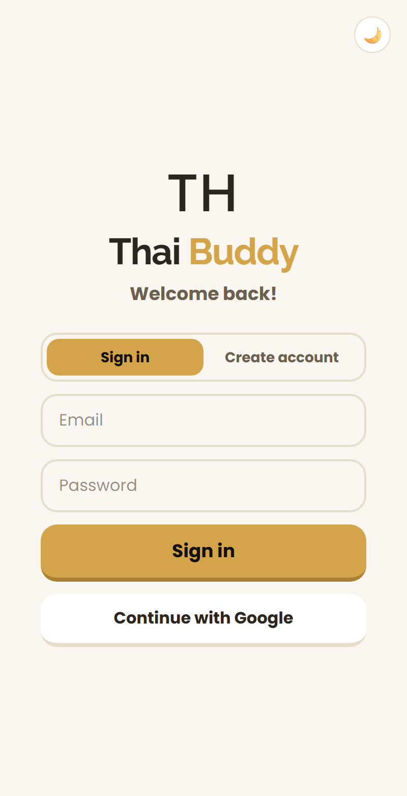
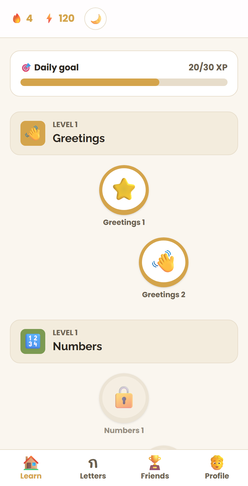
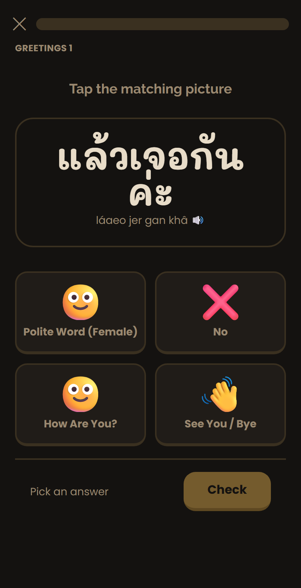
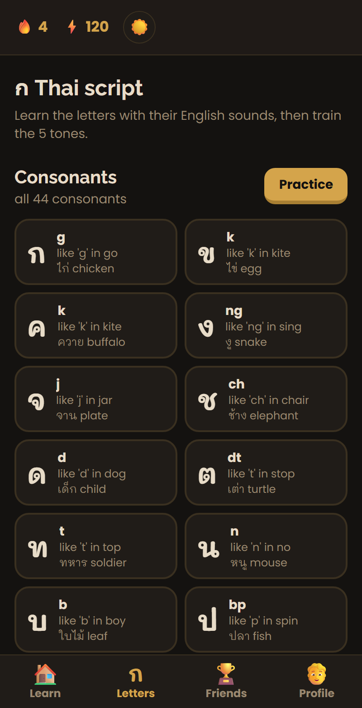
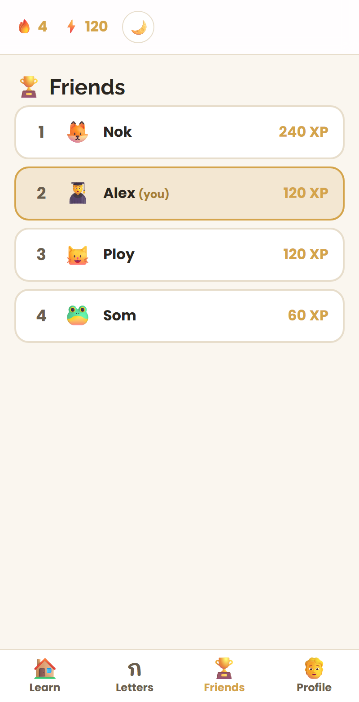

<div align="center">

# Thai Buddy 🇹🇭

**Learn Thai the fun way — a gamified, inspired by Duolingo web app built for expats and beginners.**

Picture-based vocabulary · placement test · skill tree · spaced repetition · alphabet & tone trainer · polite gendered phrasing · light & dark themes · accounts & friends.

[**▶ Live demo**](https://thai-buddy.vercel.app) · [Setup](SUPABASE_SETUP.md) · [Deploy](DEPLOY.md)


</div>

---

## Screenshots

| Sign in · _light_ | Learn map · _light_ | Sample lesson · _dark_ |
|:---:|:---:|:---:|
|  |  |  |
| **Alphabet & tones · _dark_** | **Friends · _light_** | |
|  |  | |

---

## Features

- 🎯 **Placement diagnostic** — a short adaptive quiz sorts you into one of 5 levels (Absolute Beginner → Advanced).
- 🗺️ **Skill tree** — units and lessons that unlock in sequence, with a daily-goal bar.
- 🧠 **Real teaching method (TEFL/ESL)** — each lesson *presents* new words before *practising* them, and mistakes are recycled until you get them right (no "lives" pressure).
- 🔁 **Spaced repetition** — a Leitner system schedules every word you learn for review at growing intervals.
- 🖼️ **Picture-based vocabulary** — every word pairs a clear icon with its English label (open-source glyphs, **not** AI-generated).
- ✍️ **Clear, handwritten Thai** — set in *Mali* so the script feels natural but stays legible for learners.
- 🙏 **Polite, natural Thai** — phrases use the gendered polite ending (**ค่ะ / ครับ**), and the content teaches what Thais actually say (e.g. *แล้วเจอกัน* for "bye", not the stiff textbook form).
- ก **Alphabet & Tone Trainer** — all 44 consonants and the key vowels with English-sound equivalents, plus a trainer for Thai's 5 tones.
- 🛒 **Real-life content for expats** — numbers & counting with classifiers, the market, ordering food, directions, and essential phrases.
- 🔊 **Audio** — tap any word to hear it (browser text-to-speech).
- 🌗 **Light & dark themes** — warm "Refined Ember" palette, light by default, with a one-tap toggle.
- 👤 **Accounts & friends** — email / Google sign-in, cloud-synced progress, and a friends leaderboard.
- 📱 **Installable PWA** — works in any browser and on the phone home screen.

## How it works

1. **Sign in** (email or Google), pick a username, and choose your polite ending (ค่ะ / ครับ — or skip and keep the default).
2. **Placement test** → your starting level.
3. **Learn map** → tap a lesson. Each lesson teaches the new words, then quizzes them with mixed exercise types: pick-the-picture, pick-the-meaning, pick-the-Thai, and listen-and-choose.
4. **Letters tab** → study the script and train tones.
5. **Review** → due words resurface via spaced repetition.
6. **Friends** → search by username, send/accept requests, compare XP.

### TEFL/ESL principles applied
- **Present → Practice** before testing
- **Spaced repetition** (Leitner boxes with growing intervals)
- **Mastery, not punishment** — mistakes recycle instead of costing lives
- **Comprehensible input** — pictures + English glosses everywhere
- **Varied retrieval** — recognition, recall, and listening
- **Real-life relevance** — money, market, food, directions, counting

## Tech stack

| Layer | Choice |
|---|---|
| Framework | Next.js 16 (App Router) + React |
| Language | TypeScript (strict) |
| Styling | Tailwind CSS v4 |
| Auth / DB | Supabase (Postgres, Auth, RLS) |
| Hosting | Vercel |
| Fonts | Poppins + Raleway (UI) · Mali (handwritten Thai) |

## Getting started

```bash
git clone <your-repo-url>
cd thai-buddy
npm install
npm run dev          # http://localhost:3000
```

The app runs in **local-only mode** (progress saved in the browser, no accounts) until
you add Supabase keys. To enable accounts, cloud sync, and friends, follow
[`SUPABASE_SETUP.md`](SUPABASE_SETUP.md):

```bash
cp .env.local.example .env.local   # then paste your Supabase URL + anon key
```

## Project structure

```
src/
  app/              # routes: onboarding, diagnostic, learn, lesson, letters, review, leaderboard, profile
  components/       # LessonRunner, Quiz, TopBar, BottomNav, ThemeToggle, GenderChoice
  data/             # words.ts, alphabet.ts, curriculum.ts (the content)
  lib/              # progress (state + SRS), auth, db, theme, polite, exercises, supabase client/server
  proxy.ts          # keeps the Supabase session fresh
supabase/schema.sql # tables + row-level-security policies
```

## Deployment

Deployed on Vercel — see [`DEPLOY.md`](DEPLOY.md). In short: set the two
`NEXT_PUBLIC_SUPABASE_*` environment variables in your host, then build.

## Roadmap

- [ ] Recorded native Thai audio (replace browser TTS for accurate tones)
- [ ] Sentence-builder exercise (tap words into order)
- [ ] Offline support / richer PWA install
- [ ] Harden RLS to expose only safe profile columns
- [ ] More content: deeper levels, additional phrase packs

## License

MIT — free to use and learn from.

---

<div align="center">
Built with ❤️ for learning Thai.
</div>
